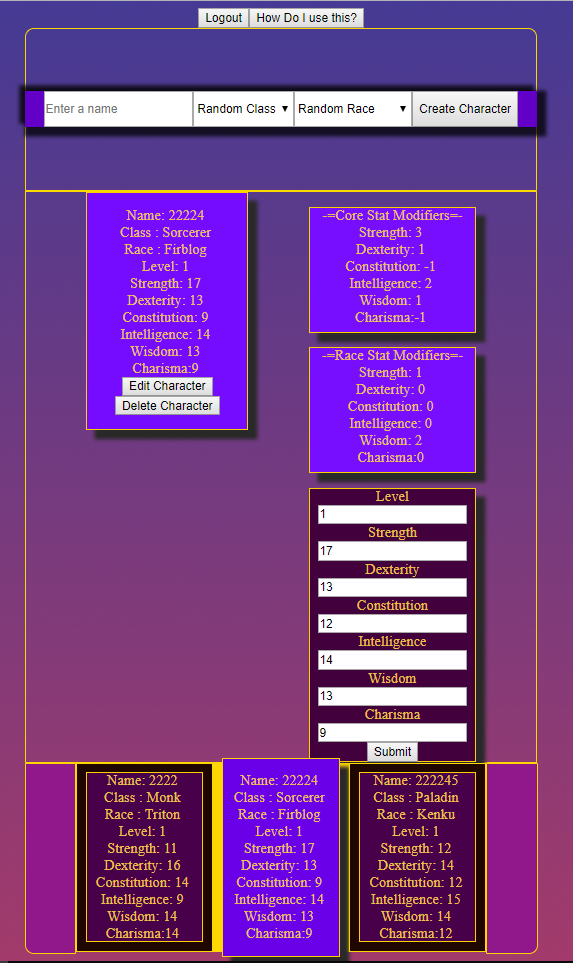

Link to the live app: https://dnd-app-frontend.herokuapp.com/
Link to github REPO: https://github.com/thinkful-ei27/David-DnD-App-Frontend

This application is the front end of a Dungeons and Dragons character creator.
You can create a character by simply  providing a name, choosing a race (random by default), and then choosing a class (random by default). This will create a character with random core stats
You may edit the stats with the edit character button.
You may also delete the characters by clicking the delete button.

